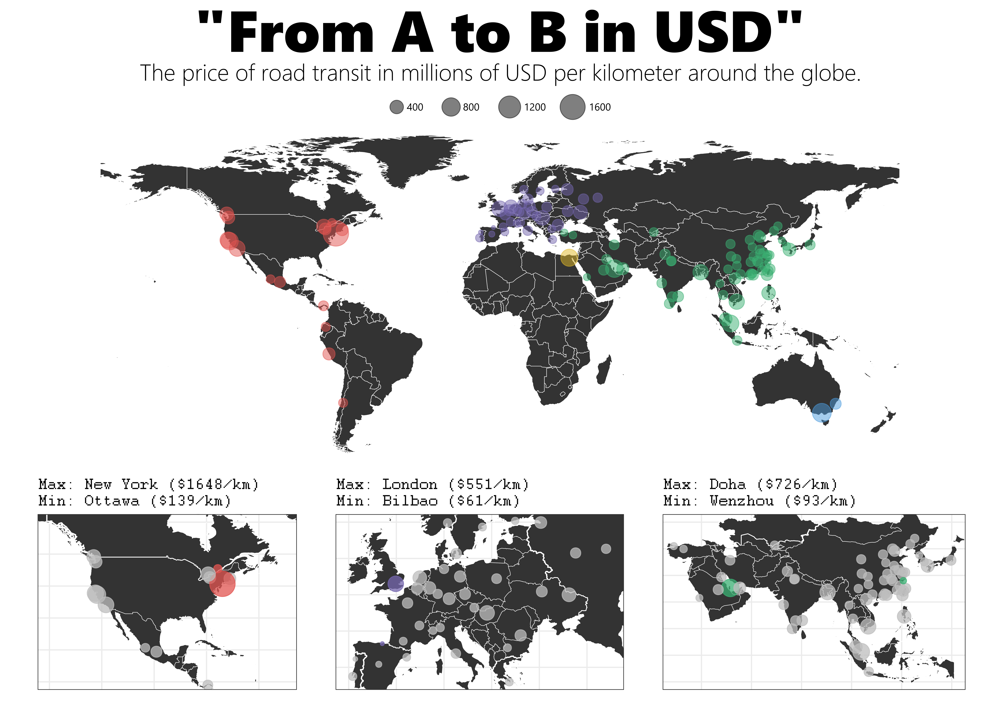

This week for TidyTuesday I produced a static map of distance-based road transit costs on a per-city basis. You can see it on my [Twitter](https://twitter.com/JDavison_) and the code will be pushed to my [GitHub](https://github.com/jack-davison).



To compliment this, I thought I'd also try to go a step further and try to learn how to use Leaflet. I've long admired Leaflet and thought it would be a really hard job, but it's actually really easy! The code and map are provided below, and you'll note that the vast majority is just me cleaning and augmenting the data - only the last bit is the Leaflet code.

```{r setup, include=FALSE}
knitr::opts_chunk$set(echo = TRUE, warning = FALSE, message = FALSE)
```

```{r}
library(tidyverse)
library(tidytuesdayR)
library(countrycode)
library(rnaturalearth)
library(leaflet)
library(htmltools)

world = ne_countries(scale = "medium", returnclass = "sf") %>%
  filter(!continent %in% c("Antarctica", "Seven seas (open ocean)"))

continents = countrycode::codelist %>%
  select(ecb, country.name.en, continent) %>%
  rename(country = country.name.en)

city_locs = readr::read_csv("worldcities.csv") %>%
  select(city, country, lat, lng) %>%
  mutate(country = if_else(country == "Korea, South", "South Korea", country))

data = tt_load("2021-01-05")$transit_cost %>%
  filter(!is.na(city)) %>%
  rename(ecb = country) %>%
  mutate(ecb = if_else(ecb == "UK", "GB", ecb)) %>%
  left_join(continents, by = "ecb") %>%
  left_join(city_locs, by = c("city", "country")) %>%
  filter(!is.na(lat)) %>%
  mutate(start_year = as.numeric(start_year)) %>%
  filter(start_year > 2000)

avgs = data %>% 
  select(city, country, continent, lat, lng, cost_km_millions) %>%
  group_by(city, country, continent, lat, lng) %>%
  summarise(avg = median(cost_km_millions)) %>%
  ungroup() %>%
  as.data.frame()

leaflet(avgs) %>%
  addTiles() %>%
  addCircles(data = avgs, lng = ~lng, lat = ~lat,
             radius = ~round(avg,0) * 200) %>%
  addMarkers(lng = ~lng, lat = ~lat, 
             clusterOptions = markerClusterOptions(),
             popup = ~paste0("<b>", city, "</b>, ",country,"<br>",
                             "$",round(avg,0)," million / km")
  )

```

See you next week!
